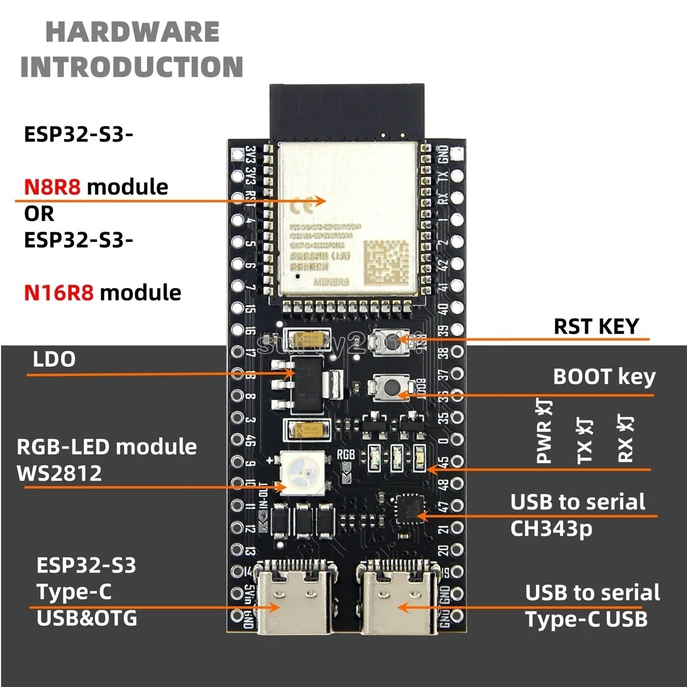
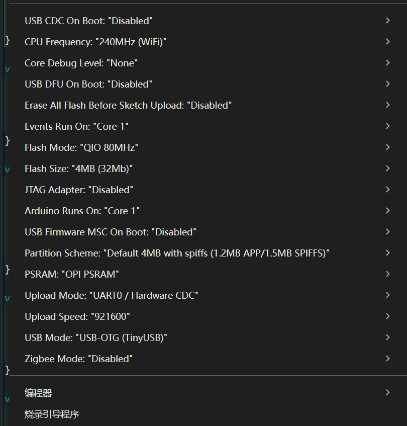

# L030 USB Host

本例程在 ESP32-S3 上使用 TinyUSB Host，插入 USB 设备后读取并打印 USB 描述符信息，重点观察设备的 `class / subclass / protocol`。

## 硬件连接

本课程使用双 Type-C 接口的 ESP32-S3 开发板：

- 右侧 `USB to serial Type-C USB`：用于烧录程序、打开串口监视器、查看调试输出。
- 左侧 `ESP32-S3 Type-C USB&OTG`：用于连接被测试的 USB 设备，例如 U 盘、鼠标、键盘、USB 声卡等。



注意：USB OTG 口作为 Host 使用时，同一个 OTG 口不能同时作为 USB CDC 串口输出日志。因此上传和调试请使用板载 USB 转串口接口。

## Arduino 设置

建议使用如下设置：

- `USB CDC On Boot`: `Disabled`
- `Upload Mode`: `UART0 / Hardware CDC`
- `USB Mode`: `USB-OTG (TinyUSB)`
- `Upload Speed`: `921600`
- `CPU Frequency`: `240MHz (WiFi)`
- `Core Debug Level`: `None`



## 程序流程

1. `setup()` 初始化串口、USB PHY 和 TinyUSB Host。
2. `loop()` 持续调用 `tuh_task()`，让 TinyUSB 处理 USB 插拔和枚举事件。
3. 插入 USB 设备后，TinyUSB 读取 Device Descriptor，并调用 `tuh_enum_descriptor_device_cb()`。
4. 程序打印 `VID:PID`、USB 版本、设备级 `class / subclass / protocol`。
5. 设备成功配置后，TinyUSB 调用 `tuh_mount_cb()`。
6. 程序读取 Manufacturer、Product、Serial 字符串描述符。
7. 如果设备级 `class` 是 `0x00`，程序会额外读取第一个 interface 的 class，显示实际设备类型。

## 串口输出示例

```text
========== USB DEVICE ==========
Address: 1
VID:PID: 056E:605F
USB BCD: 0x0210, Device BCD: 0x0200
EP0 max packet: 64
Configurations: 1
Device class=0x00 (Unspecified / per-interface), subclass=0x00, protocol=0x00
Device class 0x00 is normal: check interface class for the real device type.

Device mounted/configured. Reading string descriptors...
Effective interface class=0x08 (Mass Storage), subclass=0x06, protocol=0x50
Manufacturer: ELECOM
Product: MF-TPC3
Serial: A4630019
```

`Device class=0x00` 并不是错误。它表示设备整体不声明统一类型，真实类型写在 interface descriptor 中。比如 U 盘常见的 interface class 是 `0x08 (Mass Storage)`。

## 常见 class

| Class | 含义 |
| --- | --- |
| `0x00` | 设备级不指定，查看 interface |
| `0x01` | Audio |
| `0x02` | CDC Control |
| `0x03` | HID |
| `0x08` | Mass Storage |
| `0x09` | Hub |
| `0x0A` | CDC Data |
| `0x0E` | Video |
| `0xEF` | Miscellaneous |
| `0xFE` | Application Specific |
| `0xFF` | Vendor Specific |

## 注意事项

- USB 设备需要 Host 侧提供 5V VBUS。若设备不稳定，优先使用带外部供电的 USB Hub。
- 简单设备如鼠标、键盘、U 盘更容易枚举成功。
- 某些 USB Audio、Video 或 Vendor Specific 设备的描述符较复杂，可能无法被 TinyUSB Host 完整挂载，但仍可用于观察部分描述符。
